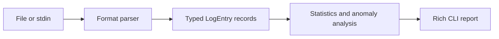

# LogSight-AI

[](https://github.com/CoreyLeath-code/LogSight-AI/actions/workflows/ci.yml)
[](https://github.com/CoreyLeath-code/LogSight-AI/actions/workflows/codeql.yml)
[](https://www.python.org/)
[](LICENSE)

LogSight-AI is a local-first Python CLI for parsing common log formats, summarizing error patterns, detecting message-length outliers, and locating error-rate spikes. The production package does not transmit logs or require credentials.

## Architecture



Supported formats include ISO-8601 application logs, syslog, nginx access logs, and generic level-prefixed lines. Detection is an explainable statistical heuristic; it is not a trained model and no accuracy claim is made without a labeled evaluation corpus.

## Quick start

```bash
python -m venv .venv
source .venv/bin/activate  # Windows: .venv\Scripts\activate
pip install -e .
logsight health
logsight analyze application.log
cat application.log | logsight stdin
```

Useful controls:

```bash
logsight analyze application.log --threshold 3.0 --window 200 --spike-threshold 0.20
```

## Verified metrics

Measured locally on 2026-07-17; CI artifacts are the canonical per-commit record.

| Metric | Value |
|---|---:|
| Automated tests | 50 passing |
| Core package coverage | 95.26% |
| Benchmark input | 1,000 lines |
| Median pipeline latency | 10.315 ms |
| Mean throughput | 96.21 runs/sec |
| Approximate line throughput | 96,213 lines/sec |
| Security findings | Pending CI security job |
| Docker image size | Pending CI build |

Results vary by hardware and Python version. See [Benchmark Guide](docs/BENCHMARKING.md) and [Benchmark Report](benchmarks/benchmark_report.md).

## Engineering controls

Every pull request runs formatting, linting, strict type checking, unit/integration/CLI tests, a 90% coverage gate, package and container validation, Bandit, dependency audit, SBOM generation, CodeQL, and a reproducible microbenchmark. Checks fail closed.

## Documentation

- [Production audit](docs/AUDIT.md)
- [Architecture](docs/architecture.md)
- [Deployment and rollback checklist](docs/DEPLOYMENT.md)
- [Benchmark methodology](docs/BENCHMARKING.md)
- [Runtime metrics](docs/metrics.md)
- [Security policy](SECURITY.md)

The Streamlit and external-LLM files are retained as demonstrations and are not part of the supported package or deployment contract; see the audit for the work required to promote them.

## Development

```bash
pip install -e ".[dev]"
ruff format .
ruff check .
mypy
pytest
```

Contributions should include tests and documentation for behavioral changes. Report vulnerabilities privately as described in [SECURITY.md](SECURITY.md).
