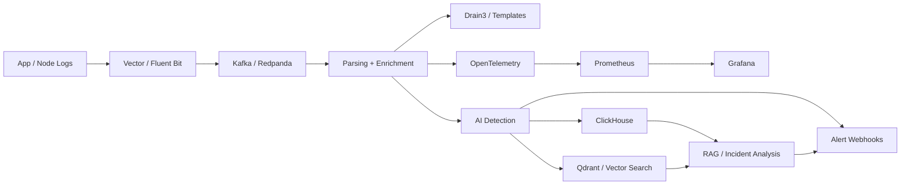

# LogSight-AI — Enterprise Log Monitoring & Anomaly Detection

[](https://github.com/CoreyLeath-code/LogSight-AI/actions/workflows/ci.yml)
[](https://github.com/CoreyLeath-code/LogSight-AI/actions/workflows/codeql.yml)
[](https://github.com/CoreyLeath-code/LogSight-AI/releases/latest)
[](https://www.python.org/)
[](LICENSE)
[](https://www.docker.com/)
[](https://fastapi.tiangolo.com/)

Overview

LogSight-AI is a local-first log analysis and anomaly-detection platform that is being extended from a deterministic CLI into a production-oriented observability stack. The original parser/analyzer remains dependency-light and explainable; enterprise integrations are optional and isolated behind adapters.

## Enterprise architecture


```mermaid
flowchart LR
    A["App / Node Logs"] --> B["Vector / Fluent Bit"]
    B --> C["Kafka / Redpanda"]
    C --> D["Parsing + Enrichment"]
    D --> E["Drain3 / Templates"]
    D --> F["AI Detection"]
    F --> G["ClickHouse"]
    F --> H["Qdrant / Vector Search"]
    D --> I["OpenTelemetry"]
    I --> J["Prometheus"]
    J --> K["Grafana"]
    F --> L["Alert Webhooks"]
    G --> M["RAG / Incident Analysis"]
    H --> M
    M --> L
```

### Five production layers

1. **Ingestion & streaming** — bounded async streams plus an optional Kafka/Redpanda adapter. Deploy Vector or Fluent Bit at the edge for collection and metadata enrichment.
2. **AI & anomaly detection** — deterministic template/frequency signals are available now. The adapter boundary supports Drain3, Sentence-Transformers/LogBERT, ONNX Runtime, and future learned detectors without replacing the core API.
3. **Storage & search** — ClickHouse event storage and Qdrant vector storage adapters are included; Redis is reserved for caching, deduplication, and rate limiting.
4. **Observability & MLOps** — OpenTelemetry span helpers and Prometheus-compatible `/metrics` are included. Model/data-drift tooling can be attached to the normalized event stream.
5. **Delivery & alerting** — `WebhookNotifier` provides a minimal outbound contract for Slack, PagerDuty, Discord, or an internal incident gateway.

## New enterprise interfaces

- `logsight.enterprise.EnrichedLog` — normalized event schema with service/source/host, trace ID, span ID, template, fingerprint, and attributes.
- `logsight.enterprise.extract_template()` — dependency-free template baseline; replace with Drain3 for high-cardinality production parsing.
- `logsight.enterprise.semantic_features()` — deterministic feature baseline; explicitly **not** represented as a learned embedding.
- `logsight.streaming.InMemoryStream` — bounded local async stream for tests and development.
- `logsight.streaming.KafkaStream` — optional Kafka/Redpanda producer using `aiokafka`.
- `logsight.storage.ClickHouseStore` and `QdrantStore` — HTTP adapters for durable analytical and semantic storage.
- `logsight.api` — optional FastAPI gateway with `/health`, `/metrics`, `/v1/logs`, `/v1/logs/batch`, and `/v1/logs/recent`.
- `logsight.observability.span()` — no-op-safe OpenTelemetry instrumentation helper.

## Enterprise local stack

The base project still runs without external services. To launch the reference enterprise stack:

```bash
docker compose -f docker-compose.enterprise.yml up --build
```

Services exposed locally:

| Service | Port | Purpose |
|---|---:|---|
| LogSight API | 8000 | Async ingestion/API gateway |
| Redpanda | 9092 | Streaming buffer |
| ClickHouse | 8123 | Log analytics/storage |
| Qdrant | 6333 | Vector similarity search |
| Redis | 6379 | Cache/dedup/rate limiting foundation |
| Prometheus | 9090 | Metrics collection |
| Grafana | 3000 | Dashboards |

Install optional Python integrations with:

```bash
pip install -e ".[api,kafka,observability,ai,parsing]"
```

The optional integrations are deliberately separated so a developer can use the original local-first CLI without downloading heavyweight ML or infrastructure clients.

## Current detection contract

The original analyzer uses explainable statistical heuristics: message-length z-score outliers, direct ERROR/CRITICAL rules, and elevated error-rate windows. These are not presented as calibrated incident probabilities. The enterprise layer preserves that evidence-first behavior while adding normalized event context and pluggable AI interfaces.

## Quick start

```bash
python -m venv .venv
source .venv/bin/activate  # Windows: .venv\\Scripts\\activate
pip install -e .
logsight health
logsight analyze application.log --explain
```

## Engineering controls

Pull requests retain the existing formatting, linting, strict typing, unit/integration/CLI tests, coverage gate, package/container validation, Bandit, dependency audit, SBOM, CodeQL, and reproducible benchmark controls. Enterprise changes should include contract tests for adapters and load tests before production rollout.

## Roadmap

- [x] Normalized enterprise event contract
- [x] Kafka/Redpanda ingestion adapter
- [x] ClickHouse/Qdrant storage adapters
- [x] FastAPI async gateway
- [x] Prometheus endpoint and OpenTelemetry helper
- [x] Enterprise Docker Compose reference stack
- [ ] Drain3 production parser adapter
- [ ] Sentence-Transformers/LogBERT embedding worker
- [ ] ONNX Runtime inference worker
- [ ] Redis-backed deduplication/rate limiting
- [ ] OTel Collector deployment and trace-log correlation pipeline
- [ ] Celery/Ray distributed inference workers
- [ ] Helm chart with HPA/PDB/network policies
- [ ] RAG incident investigator with versioned runbooks/commits
- [ ] Labeled benchmark corpus with precision/recall and alert-burden metrics

## Documentation

- [Production audit](docs/AUDIT.md)
- [Architecture](docs/architecture.md)
- [Deployment and rollback checklist](docs/DEPLOYMENT.md)
- [Benchmark methodology](docs/BENCHMARKING.md)
- [Mathematical foundations](docs/MATHEMATICAL_FOUNDATIONS.md)
- [Security policy](SECURITY.md)

## License

MIT
