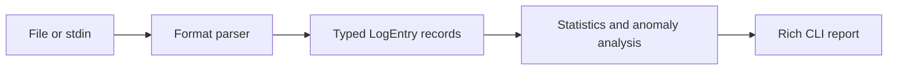

# LogSight-AI — Explainable Log Analysis Heuristics

[](https://github.com/CoreyLeath-code/LogSight-AI/actions/workflows/ci.yml)
[](https://github.com/CoreyLeath-code/LogSight-AI/actions/workflows/codeql.yml)
[](https://www.python.org/)
[](benchmarks/benchmark_report.md)
[](docs/BENCHMARKING.md)
[](#architecture)
[](LICENSE)

## Abstract

LogSight-AI is a local-first Python CLI that parses common log formats, summarizes error patterns, flags message-length outliers, and identifies elevated error-rate windows. Its production package does not transmit logs or require credentials. The detector is an explainable statistical heuristic—not a trained incident classifier, root-cause system, or measured accuracy claim.

## Formal detection logic

For $N$ parsed entries with message lengths $\ell_i$, the analyzer computes the population mean $\mu$ and population standard deviation $\sigma$. When $\sigma>0$, it flags a length outlier only when

\[
z_i=\frac{|\ell_i-\mu|}{\sigma}>\tau_z,\qquad \tau_z=2.5\ \text{by default}.
\]

Separately, ERROR and CRITICAL entries are flagged by a direct rule. For each complete, non-overlapping window of $W$ entries, it reports an error-rate spike when

\[
r_j=\frac{e_j}{W}\geq\tau_r,\qquad W=100,\quad \tau_r=0.25\ \text{by default}.
\]

These definitions map directly to [logsight/analyzer.py](logsight/analyzer.py); zero-variance message lengths receive no z-score, and partial trailing windows are intentionally excluded. Read the complete [mathematical foundations](docs/MATHEMATICAL_FOUNDATIONS.md) and [complexity analysis](docs/COMPLEXITY_ANALYSIS.md).

## Evidence snapshot

| Evidence | Value | Scope |
|---|---:|---|
| Development benchmark input | 1,000 log lines | Local pipeline microbenchmark, 2026-07-17 |
| Median / mean latency | 10.315 / 10.394 ms | Development baseline; not a service SLO |
| Mean throughput | 96.21 pipeline runs/s | Same 1,000-line local workload |
| Detection threshold | z-score > 2.5 | Fixed default policy, not a calibrated significance level |
| Spike threshold | error rate >= 0.25 in 100 entries | Fixed default policy, not a learned decision boundary |

The dated measurements are recorded in [benchmarks/benchmark_report.md](benchmarks/benchmark_report.md). CI generates and retains per-commit benchmark JSON; compare only like-for-like Python, hardware, workload, and warm-up configurations. No labeled incident dataset or precision/recall result is committed.

## Research questions

1. What precision, recall, and alert burden do error-level, z-score, and error-rate rules produce on a versioned labeled corpus?
2. How do non-overlapping, overlapping, and time-based windows trade detection delay against false alerts?
3. How stable are fixed thresholds across formats, services, and message-length distributions?
4. How do parsing and analysis latency scale with line count, line length, and unique-message cardinality?

The [academic audit](docs/ACADEMIC_AUDIT.md) documents the repository's direct algorithmic strengths, evidence boundaries, and next experiments.

## Architecture


```mermaid
flowchart LR
    A["File or stdin"] --> B["Format parser"]
    B --> C["Typed LogEntry records"]
    C --> D["Statistics and anomaly analysis"]
    D --> E["Rich CLI report"]
```

Supported formats include ISO-8601 application logs, syslog, nginx access logs, and generic level-prefixed lines. Detection is an explainable statistical heuristic; it is not a trained model and no accuracy claim is made without a labeled evaluation corpus.

## Evidence-backed reasoning

The optional `--explain` flag turns existing detector output into concise, user-facing evidence statements. Each statement identifies its direct or statistical basis: parsed error level, message-length z-score with its configured threshold, or observed error count/rate in a complete analysis window. LogSight does not infer an incident root cause, use an LLM, send logs externally, or report a model-confidence score.

```bash
logsight analyze application.log --window 200 --spike-threshold 0.20 --explain
cat application.log | logsight stdin --explain
```

## Quick start

```bash
python -m venv .venv
source .venv/bin/activate  # Windows: .venv\Scripts\activate
pip install -e .
logsight health
logsight analyze application.log
cat application.log | logsight stdin
```

Useful controls:

```bash
logsight analyze application.log --threshold 3.0 --window 200 --spike-threshold 0.20
```

## Verified metrics

Measured locally on 2026-07-17; CI artifacts are the canonical per-commit record.

| Metric | Value |
|---|---:|
| Automated tests | 50 passing |
| Core package coverage | 95.26% |
| Benchmark input | 1,000 lines |
| Median pipeline latency | 10.315 ms |
| Mean throughput | 96.21 runs/sec |
| Approximate line throughput | 96,213 lines/sec |
| Security findings | Pending CI security job |
| Docker image size | Pending CI build |

Results vary by hardware and Python version. See [Benchmark Guide](docs/BENCHMARKING.md) and [Benchmark Report](benchmarks/benchmark_report.md).

## Engineering controls

Every pull request runs formatting, linting, strict type checking, unit/integration/CLI tests, a 90% coverage gate, package and container validation, Bandit, dependency audit, SBOM generation, CodeQL, and a reproducible microbenchmark. Checks fail closed.

## Documentation

- [Production audit](docs/AUDIT.md)
- [Architecture](docs/architecture.md)
- [Deployment and rollback checklist](docs/DEPLOYMENT.md)
- [Benchmark methodology](docs/BENCHMARKING.md)
- [Runtime metrics](docs/metrics.md)
- [Security policy](SECURITY.md)

The Streamlit and external-LLM files are retained as demonstrations and are not part of the supported package or deployment contract; see the audit for the work required to promote them.

## Development

```bash
pip install -e ".[dev]"
ruff format .
ruff check .
mypy
pytest
```

Contributions should include tests and documentation for behavioral changes. Report vulnerabilities privately as described in [SECURITY.md](SECURITY.md).
